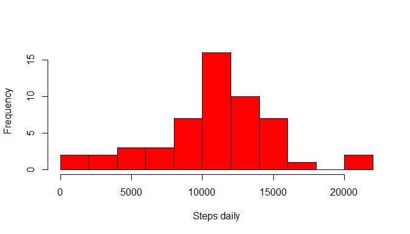
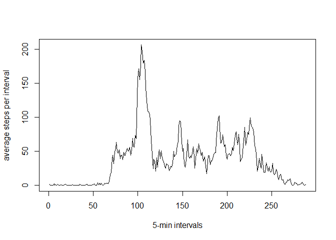
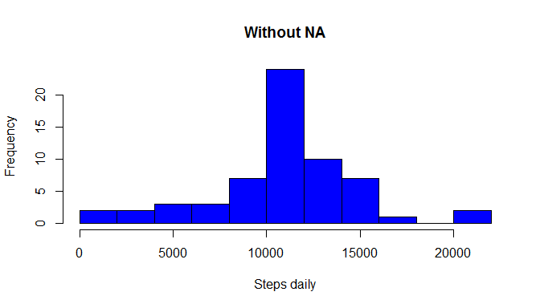

# Reproducible Research: Peer Assessment 1


## Loading and preprocessing the data
- Load data into dataframe "activityData" using `read.csv()` 
- Remove `NA`
- Convert dates


```r
input<-read.csv("activity.csv")
activityData<-input[complete.cases(input),]
head(activityData)
```

```
##     steps       date interval
## 289     0 2012-10-02        0
## 290     0 2012-10-02        5
## 291     0 2012-10-02       10
## 292     0 2012-10-02       15
## 293     0 2012-10-02       20
## 294     0 2012-10-02       25
```


Aggregate data into daily steps

```r
activityDays<-aggregate(activityData[, 1], list(activityData$date), sum)
names(activityDays)<-c("Date","Steps")
```

## What is mean total number of steps taken per day?
Create histogram

```r
hist(activityDays$Steps, col = "red",xlab="Steps daily",main="",breaks=15)
```

 


Calculate simple statistics:

```r
mean(activityDays$Steps)
```

```
## [1] 10766.19
```

```r
median(activityDays$Steps)
```

```
## [1] 10765
```

So, the mean total number of steps is very close to median and equal 10766.

## What is the average daily activity pattern?
Again convert data:

```r
activityIntervals<-aggregate(activityData[, 1], list(activityData$interval), mean)
plot(activityIntervals$x,type="l",xlab="5-min intervals",ylab="average steps per interval")
```

 

Maximum steps in this 5-minute interval:

```r
activityIntervals[activityIntervals$x==max(activityIntervals$x),]$Group.1
```

```
## [1] 835
```
8:35 could means morning exercises of walk to office by foot.

## Imputing missing values
Calculate number of NA:

```r
sum(is.na(input$steps))
```

```
## [1] 2304
```
It's about

```r
round(sum(is.na(input$steps))/nrow(input),2)
```

```
## [1] 0.13
```
 of data.
 
 Function that enriches data with average daily steps for current interval:

```r
newData<-input
fg<-function(){
  for (i in 1:nrow(newData)){
    if(is.na(newData$steps[i])==TRUE){
      newData$steps[i]<-activityIntervals[activityIntervals$Group.1==newData$interval[i],2]
    } 
  }
  newData
}
newData<-fg()
```
 Let's check on `NA` again:

```r
 sum(is.na(newData$steps))
```

```
## [1] 0
```


```r
activityDays2<-aggregate(newData[, 1], list(newData$date), sum)
```

Create histogram:

```r
hist(activityDays2$x, col = "blue",xlab="Steps daily",main="Without NA",breaks=15)
```

 

Calculate simple statistics:

```r
mean(activityDays2$x)
```

```
## [1] 10766.19
```

```r
median(activityDays2$x)
```

```
## [1] 10766.19
```
When we add some non-zero values into data we increase median.


## Are there differences in activity patterns between weekdays and weekends?
